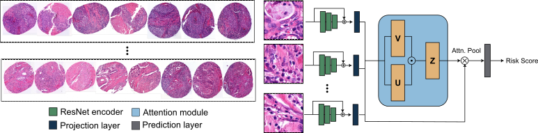

# Cox-AMIL

## Attention-based Multiple Instance Learning for Survival Prediction on Lung Cancer Tissue Microarrays 

This repository contains the code that was used for our BVM workshop sumbission *Attention-based Multiple Instance Learning for Survival Prediction on Lung Cancer Tissue Microarrays* available on [ArXiv](https://arxiv.org/abs/2212.07724). 

The code is based on the [CLAM](https://github.com/mahmoodlab/CLAM) framework for weakly-supervised classification on whole-slide images. The images were preprocessed as described in the original documentation. The model was trained using `main_survival.py`. Some evaluations are availabe in `tma_notebooks\09_evaluation_Ostercappeln.ipynb`.

## License

The code is released under the GPLv3 License following the original code base [here](https://github.com/mahmoodlab/CLAM).

## Acknowledgements

J.A. acknowleges funding by the [Bavarian Institute for Digital Transformation](https://badw.de/bayerisches-forschungsinstitut-fuer-digitale-transformation.html) from the Project [ReGInA](https://en.bidt.digital/regina/).